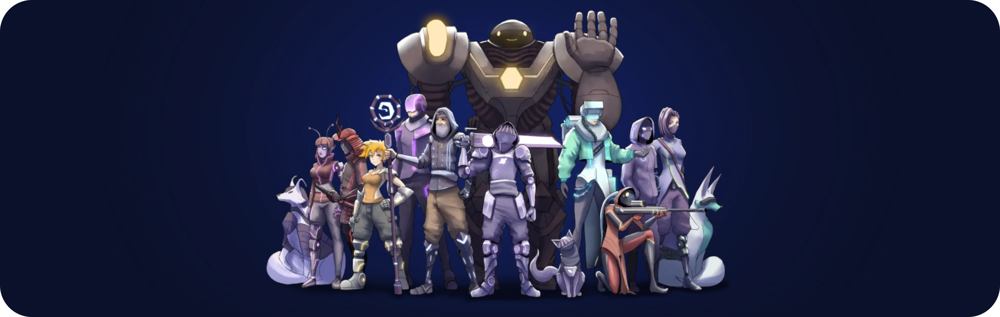

# EverywhereGamingStudios dApp

A source of reliable, high-quality services and immersive experiences.

## Projects

### Cosmic Exodus Game

**Cosmic Exodus**, an immersive strategy GameFi experience.

Assemble your favorite troops and towers to fight the forces of Kairos,
the god of time and space. Those who explore and compete will discover many treasures!
Will you emerge victorious?

Do you have what it takes to be at the forefront of this ecosystem?

* Zero initial costs involved.
* No pay to win.
* Unique 3D assets and sound.
* No token was involved at an early stage.

Sounds interesting? If you're into Tower Defense games, I invite you to dive in and feel the Cosmic energy for yourself!

## Development

> :information_source: This is a [React.js](https://reactjs.org/), [Next.js](https://nextjs.org/) project bootstrapped with [nextjs](https://github.com/MoralisWeb3/Moralis-JS-SDK/tree/main/demos/nextjs) Moralis's demo.
>
> Make sure you have Redis server at 6379 port and MongoDB server open at 27017 port.

1. Change directory to the project's root, and install dependencies by simply typing `yarn` on your terminal;
2. Copy `.env.local.example` to `.env.local` and fill in the values.
3. Run the development server with `yarn dev` command;
4. Open [http://localhost:3000](http://localhost:3000) on your browser to see live changes.

## Deployment

Deployed by [Vercel](https://vercel.com/), available at [everywheregamingstudios-dapp.vercel.app](https://everywheregamingstudios-dapp.vercel.app/).

---

EverywhereGamingStudios 2022
